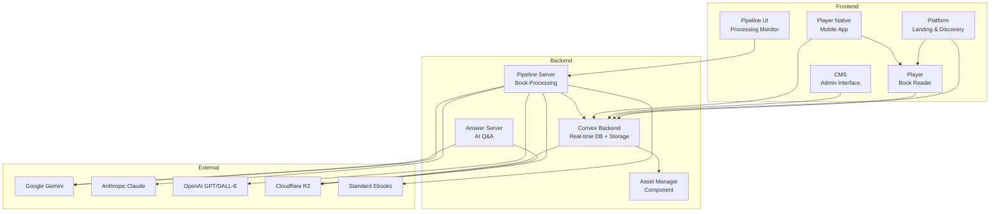

# BookGenius Codebase Map

> Auto-generated by Cartographer. Last mapped: 2026-01-14

## System Overview

BookGenius is an interactive ebook reader platform with AI-powered content generation. The platform transforms public domain books into immersive reading experiences with character avatars, background scenes, music cues, and AI-powered Q&A.



## Directory Structure

```
bookgenius/frontend/
├── apps/
│   ├── player/              # Main book reader (React + Vite)
│   │   ├── src/
│   │   │   ├── components/  # UI components (~5k lines)
│   │   │   ├── services/    # Content processing, scroll, position tracking
│   │   │   ├── hooks/       # React hooks for book content
│   │   │   ├── context/     # BookConvex, Realtime, PlayerDOM contexts
│   │   │   ├── stores/      # Zustand stores (modals, settings)
│   │   │   ├── logic/       # BookIndex, Virtualizer, TextCache
│   │   │   ├── ui/          # Background, highlighting utilities
│   │   │   └── styles/      # Tailwind + CSS
│   │   └── scripts/         # Video processing, build scripts
│   │
│   ├── bookgenius-cms/      # Admin CMS (Next.js 15)
│   │   ├── app/             # App Router pages
│   │   ├── admin/           # Core CMS components
│   │   │   └── components/  # Book views, dialogs, editors
│   │   ├── lib/             # Contexts, hooks, queries
│   │   └── scripts/         # Import/migration scripts
│   │
│   ├── pipeline/            # Book processing pipeline
│   │   ├── src/
│   │   │   ├── tools/       # Processing scripts (~126k tokens)
│   │   │   ├── server/      # tRPC server + orchestrator
│   │   │   ├── services/    # Answer server, embeddings
│   │   │   └── helpers/     # File I/O, settings
│   │   └── books-data/      # Processed book assets (gitignored)
│   │
│   ├── platform/            # Marketing landing page (Vite SSG)
│   │   └── src/
│   │       ├── components/  # BookCollection, Hero, Paywall
│   │       ├── integrations/ # Auth (Clerk/Snapplify), Payments
│   │       └── providers/   # Language, RouteTransition
│   │
│   ├── pipeline-ui/         # Pipeline visual interface
│   │   └── src/
│   │       ├── pages/       # StandardEbooks, Collections
│   │       └── components/  # StyleSelection, Progress
│   │
│   ├── player-native/       # React Native mobile app
│   │   ├── app/             # Expo Router screens
│   │   └── src/
│   │       ├── components/  # WebView, NativeMusicPlayer
│   │       └── contexts/    # Book, Location, NativeShell
│   │
│   └── convex-sync/         # Asset sync daemon
│       └── src/             # Sync logic, config, client
│
├── convex/                  # Backend
│   ├── components/
│   │   └── asset-manager/   # Reusable storage component
│   ├── bookQueries.ts       # Book domain queries
│   ├── generator.ts         # Pipeline progress tracking
│   ├── authz.ts             # Admin authorization
│   ├── bookAuthz.ts         # Book-level authorization
│   ├── functions.ts         # Custom function builders
│   └── schema.ts            # Database schema
│
├── tools/scripts/           # Admin utilities
└── ConvexReactiveAssets/    # iOS Swift asset provider
```

## Module Guide

### apps/player/ - Interactive Book Reader

**Purpose**: Core ebook reading experience with virtualized scrolling, audio/video backgrounds, character interactions, and AI-powered voice/text Q&A.

**Entry Point**: `src/LiveModeApp.tsx`

**Key Subsystems**:

| Subsystem  | Files       | Purpose                                                    |
| ---------- | ----------- | ---------------------------------------------------------- |
| Components | ~5k lines   | UI: Header, Footer, BottomInput, AudioPlayer, Modals       |
| Services   | ~3k lines   | Content processing, scroll coordination, position tracking |
| Hooks      | ~2k lines   | useBookContent, useCurrentSpeakers, useBackgroundVideo     |
| Context    | ~3k lines   | BookConvexContext, RealtimeContext, PlayerDOMContext       |
| Logic      | ~1.5k lines | BookIndex, BookContentVirtualizer, TextCacheManager        |
| Stores     | ~1k lines   | Zustand stores for modals, settings, editor state          |

**Key Exports**:

- `BookGeniusPlayer` - Embeddable player component
- `readingPositionTracker` - Position sync singleton
- `scrollCoordinator` - Scroll state management
- `bookIndex` - Book structure singleton

**Notable Patterns**:

- **Virtualization**: 3-chapter sliding window with TopSpacer compensation
- **Audio Crossfader**: 8s crossfades, streaming decode, Web Audio API
- **Position Tracking**: Candidate→Commit gate with dwell times for stability
- **Realtime Voice**: OpenAI Realtime API with push-to-talk

---

### apps/bookgenius-cms/ - Admin Interface

**Purpose**: Next.js admin CMS for managing books, characters, chapters, backgrounds, and music cues.

**Entry Point**: `app/admin/page.tsx`

**Key Features**:

- Three-panel layout (folders, assets, detail)
- Monaco Editor for XML/chapter editing
- Drag-drop file uploads with concurrent queue
- Version history and restore
- Book-aware folder pattern detection

**Key Components**:

- `AdminPanel` - Main layout orchestrator
- `BookDashboard` - Book overview with stats
- `CharacterGrid` - Character management
- `ChapterEditorView` - Full Monaco editor with autocomplete
- `BackgroundCuesView` / `MusicCuesView` - Cue management

**Notable Patterns**:

- URL-based state (`?folder=...&asset=...`)
- Context-free UI (uses `BookContext` wrapper)
- TanStack Query with hover prefetching

---

### apps/pipeline/ - Book Processing Pipeline

**Purpose**: AI-powered pipeline transforming EPUB/FB2 files into interactive content with characters, avatars, backgrounds, and embeddings.

**Entry Points**:

- `src/server/index.ts` - tRPC server
- `src/server/pipeline.ts` - Main orchestrator

**Pipeline Steps**:

1. `import_epub` - Convert to rich.xml
2. `create_settings` - Extract metadata
3. `generate_reference_cards` - Character extraction (Gemini)
4. `rewrite_paragraphs` - Tag character mentions (Gemini/Claude/GPT)
5. `generate_graphical_style` - Visual style config
6. `generate_entity_pictures` - Character avatars (OpenAI/Flux)
7. `map_summaries_to_paragraphs` - Paragraph-level mapping
8. `generate_embeddings` - Vector embeddings (Gemini)
9. `upload_answer_server_data` - Upload to R2
10. `generate_backgrounds` - Scene images (OpenAI/Flux)

**AI Integration**:
| Service | Model | Purpose |
|---------|-------|---------|
| Gemini | gemini-3-flash/pro | Character extraction, summaries, embeddings |
| Claude | claude-opus-4-5 | Paragraph rewriting (primary) |
| OpenAI | gpt-5, gpt-image-1.5 | Fallback + image generation |
| Grok | grok-4.1-fast | Fast inference fallback |

**Notable Patterns**:

- Multi-provider fallback with rotation
- Chunking for long chapters (110k token limit)
- Content safety with LLM sanitization
- Parallel step execution with dependencies

---

### apps/platform/ - Landing Page

**Purpose**: Marketing site for book discovery with auth and payments.

**Entry Point**: `src/main.tsx`

**Key Features**:

- Static site generation with Vite SSG
- Clerk/Snapplify auth integration
- Language detection (domain-based)
- Lazy-loaded player integration

**Notable Patterns**:

- Plugin-based auth/payment providers
- Route transitions with `RouteTransitionProvider`
- Book metadata from Convex

---

### apps/pipeline-ui/ - Pipeline Monitor

**Purpose**: Visual interface for pipeline operations.

**Entry Point**: `src/ui/App.tsx`

**Key Features**:

- Source selection (upload, Wolne Lektury, Standard Ebooks)
- Chapter editor with Monaco
- Style preview comparison
- Real-time progress monitoring

**Communication**: tRPC client → `apps/pipeline/src/server/router.ts`

---

### apps/player-native/ - Mobile App

**Purpose**: React Native wrapper embedding web player with native enhancements.

**Entry Point**: `app/index.tsx`

**Key Features**:

- WebView embedding with message passing
- Native audio crossfade (expo-audio)
- Native character overlays
- Convex data fetching

**Notable Patterns**:

- Hybrid native/web architecture
- Message protocol for state sync
- Native handles heavy operations (audio, video)

---

### convex/ - Backend

**Purpose**: Convex backend with real-time DB, file storage, and authorization.

**Key Tables**:
| Table | Purpose |
|-------|---------|
| `books` | Book ownership and metadata |
| `characterMetadata` | Character display info, AI prompts |
| `chapterMetadata` | Chapter info per asset |
| `bookMembers` | Collaborator access control |
| `notes` | Footnotes/annotations |
| `variants` | Sentence simplifications |
| `backgroundCues` | Background-to-position links |
| `musicCues` | Music-to-position links |
| `bookGenerationJobs` | Pipeline progress tracking |

**Key Patterns**:

- **bookMutation**: Auto-enforces book access, provides `ctx.bookDb`
- **Asset Manager Component**: Versioned storage with R2/Convex backends
- **Changelog Pattern**: Real-time sync with cursor pagination
- **Soft Delete**: 30-day retention before hard deletion

---

### convex/components/asset-manager/ - Storage Component

**Purpose**: Reusable file storage with versioning, soft-delete, and dual backends.

**Key Features**:

- Intent-based uploads (two-phase commit)
- Version history with restore
- R2 or Convex storage backends
- Changelog for real-time sync

**Key Exports**:

- `startUpload()` / `finishUpload()` - Upload flow
- `createFolderByPath()` - Folder creation
- `getPublishedFile()` - URL generation
- `processExpiredR2Deletions()` - Cleanup cron

---

### apps/convex-sync/ - Asset Sync Daemon

**Purpose**: Real-time local asset synchronization for development.

**Key Features**:

- WebSocket subscription to changelog
- Parallel downloads with xattr tracking
- Cursor-based pagination

---

## Data Flow

### Book Reading Flow

```
User opens book URL
    ↓
Platform → Player (lazy load)
    ↓
BookConvexContext queries chapters from Convex
    ↓
ensureCompiledChaptersLoaded() → fetch HTML from storage
    ↓
normalizeChapterHtml() → inject play-rows, data-index
    ↓
bookIndex.initializeWith() → parse structure
    ↓
BookContentVirtualizer mounts 3-chapter window
    ↓
pageObserver tracks paragraph visibility
    ↓
readingPositionTracker syncs position (throttled)
```

### Book Processing Flow

```
User uploads EPUB/FB2 or selects Standard Ebooks
    ↓
Pipeline-UI → tRPC → Pipeline Server
    ↓
[import_epub] Convert to rich.xml
    ↓
[Parallel: reference_cards + chapter_summaries + graphical_style]
    ↓
[rewrite_paragraphs] Tag characters (Gemini/Claude)
    ↓
[Parallel: entity_pictures + backgrounds]
    ↓
[generate_embeddings] Create vectors (Gemini)
    ↓
[upload_answer_server_data] → R2
    ↓
[uploadChaptersToConvex] → Convex asset-manager
```

### AI Q&A Flow

```
User asks question (voice or text)
    ↓
Player → Answer Server (/ask/stream SSE)
    ↓
getEmbeddingQueriesForQuestion() → Cerebras query expansion
    ↓
findBestPassages() → cosine similarity search
    ↓
Stream results back via SSE
    ↓
[Optional] deepResearch() for multi-chapter analysis
```

## Conventions

### Code Style

- **TypeScript 5.8.2** with strict mode
- **Semicolons**, camelCase
- **Prettier** (printWidth: 100)

### File Naming

- Components: `PascalCase.tsx`
- Hooks: `useCamelCase.ts`
- Stores: `camelCase.store.ts`
- Utilities: `camelCase.ts`

### State Management

- **Convex**: Server state, real-time data
- **Zustand**: Client state (modals, UI)
- **React Context**: App-wide state (book data, auth)
- **URL Params**: Navigation state

### Folder Conventions (Convex)

```
books/{slug}/
  characters/{character-slug}/
    avatar.png, avatar-large.png
    speaks.mp4, listens.mp4
  chapters-source/
    chapter-1.html (Format B compiled)
  backgrounds/
    ch1-p0.mp4
  music/
    scene1.mp3
  figures/
    image1.jpg
```

## Gotchas

### Player

- **Virtualizer scroll compensation**: TopSpacer adjusts height when removing chapters above viewport
- **Position tracking dwell times**: Small jumps (450ms), medium (800ms), large (1500ms) before commit
- **Audio crossfader**: 8s fades, uses monotonic tokens to prevent race conditions
- **HMR support**: Critical modules export hot-reloadable helpers

### Pipeline

- **Token limits**: Chapters chunked at 110k tokens (Gemini 200k context)
- **Content moderation**: Light sanitization → LLM rewrite → abstract fallback
- **Provider rotation**: Tools cycle through [Gemini, Claude, GPT, Grok] on failures

### Convex

- **Asset versions**: Always creates new version, archives old (no in-place updates)
- **Soft delete**: 30-day grace period in `pendingR2Deletions`
- **bookMutation pattern**: `ctx.bookDb` auto-verifies all operations belong to authorized book

### CMS

- **Monaco autocomplete**: Type `<` to trigger character tag suggestions
- **Version switching**: Read-only mode for archived versions
- **Upload queue**: 4 concurrent uploads max

## Navigation Guide

**To add a new book**:

1. Use Pipeline UI or CLI to process EPUB/FB2
2. Pipeline creates Convex folders and uploads assets
3. CMS for metadata editing and cue management

**To add a new character**:

1. CMS → Book → Characters → Create Character
2. Upload avatar-large.{png,webp}
3. Optionally add speaks.mp4 and listens.mp4

**To edit chapter content**:

1. CMS → Book → Chapters → Select chapter
2. Monaco editor opens with XML
3. Auto-save (debounced) or Cmd+S for manual save

**To modify auth/payments (Platform)**:

1. Set `VITE_AUTH_PROVIDER` env var
2. Implement provider in `integrations/auth/`
3. `IntegrationsProvider` loads dynamically

**To add new pipeline step**:

1. Add step definition in `pipeline.ts`
2. Update dependencies in `parallel-scheduler.ts`
3. Create tool script in `src/tools/`

**To test locally**:

```bash
bun run dev:player      # Player on port 5173
bun run dev:platform    # Platform on port 8080
cd apps/bookgenius-cms && bun dev  # CMS on port 3001
npx convex dev          # Backend with hot reload
```
